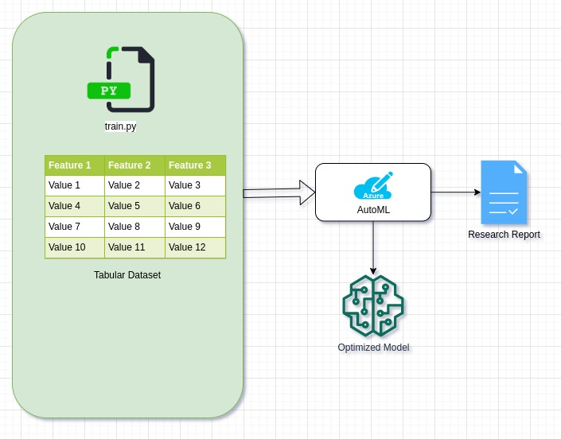

# Optimizing an ML Pipeline in Azure

## Overview
This project is part of the Udacity Azure ML Nanodegree.
In this project, we build and optimize an Azure ML pipeline using the Python SDK and a provided Scikit-learn model.
This model is then compared to an Azure AutoML run.

## Summary

We had a bank marketing data which contains around <b>32950</b> observations and <b>21</b> features with one target variable <b>"y"</b> which we think it as a indicator for that customer lead gets interested or not.

The main work for me here is to provide a solution which works best for this problem statement with the use of AzureML.

We have trained a <b>LogisticRegression</b> algorithm of Scikit-learn that has two hyperparams which can impact on the result of the model's performance. Hence, we used hyperdrive config method of AzureML to get which hyperparams works best for us.

Also, we are not limited by using the LogisticRegression only. We have to explore diffrent alogorithms as well. To do that like one by one, it would take so much time and resource. Hence we used <b>AutoML</b> of AzureML to get best performing model for our problem.

Finally, By comparing all the results, we came to conclusion that <b>VotingEnsemble</b> algorithm works best for our problem statement compared to other algorithms.

## Scikit-learn Pipeline

- Architecture

    
    
    As shown in above diagram, There mainly 5 points to look
    1. Prepared Dataset
       
       We have to create one method for preparing the dataset which should do all the pre-processing on dataset such as feature-engineering, null value handling etc.
    2. Selected scikit-learn algo to train
       
       After the completing the prepare-dataset method, we have to select the algorithm  on which we want to train the prepared dataset, Here, we used the LogisticRegression algorithm from scikit-learn.
    3. Using Hyperdrive to choose the ideal hyper-params
    
        After creating one training script. In which, we are feeeding the prepared tabular dataset to the LogisticRegression algorithm. We have created the script in a such a way that, the hyper-params can be controlled from the outside.
                
            python train.py --C 0.5 --max_iter 60 
            
            Here C and max_iter are the hyper-params
                
        We have to choose which hyper-param to optimize and for which concerned  metric parameter such as rmse, accuracy etc. 
                    
        We used RandomParameterSampling sampler to choose hyper-param "C" uniformly between 0.4 to 1.0. Because of these config hyper-drive randomly passes values from 0.4 to 1.0 as an argument to training script.
        
        We also have to provide termination policy. For that we used BanditPolicy with slack_factor = 0.1, evaluation_interval = 1 and delay_evaluation = 2. The above param means whenver our model gets low metric compared to 1/(1+0.1)=0.9090 then it stops the process.         
    4. Get the best optimized model
        
        After doing the primary configuration of the hyperdrive config, we started the HyperDrive by submitting the hyperdrive configuration for an experiment in Azure Workspace. At the end, we get the best model which is 91.6% accuracy one LogisticRegression algo from the hyperdrive experiment run.
                
    5. Research Report
        
        After few minutes, we will have detailed report consisting plots and results of comparision of diffrent hyperparams used to achieve the target primary metric.
        
         
    
       
    
   The main point of this pipeline is to get the ideal hyper-params of model so that time and efforts of the ML engineer could be saved.

## AutoML

  We have used following configuration for AutoML.
    
    automl_config = AutoMLConfig(experiment_timeout_minutes=30,
                                    task= "classification",
                                    primary_metric= "accuracy",
                                    training_data= df,
                                    label_column_name= 'y',
                                    n_cross_validations=7)
                                    

  As shown in above code snippet, we have specified experiment timeout minutes 30, type of algo should be a classification and the target primary metric = "accuracy".
  
  After the completion of AutoML, we got the best model as a "<b>VotingEnsemble</b>" algorithm with the <b>91.70%</b> accuracy. The model hyper-params used for VotingEnsemble are  min_samples_leaf = 0.01, min_samples_split=0.01, min_weight_fraction_leaf=0.0, n_estimators=10 and n_jobs=1.
  
  The other metrics we got other than accuracy are as below.
  
 

## Pipeline comparison

Key | Hyperdrive Pipeline | AutoML Pipeline
| ------------- | ------------- | ------------- 
Architecture |  | 
Accuracy | LogisticRegression with 91.47% | VotingEnsemble with 91.66%
Duration | 18.3 minute | 33.2 minute
Compute Target | compute cluster | local
Confusion Matrix | Not Available | Available
Explanations | Not Available | Available

As shown in diagram, the main diffrence between two pipeline is the flexibility of AutoML. The Hyperdrive only focuses on the specific algorithm's hyper-params whether the AutoML uses all the range of algorithms for target task and provide the best working algorithm.

However some visible diffrences between HyperDriver and AutoML are as below.
- Keeping the time in mind, the duration taken by AutoML is more than the duration taken by HyperDrive.
- Metrics provided by the AutoML are clean and explainable by diffrent metrics but in HyperDrive, we have limited options to compare model by diffrent matrix

Thus, we should use AutoML when we required lots of computation power and resources and we should use the HyperDrive when we have our algorithm but not the best hyperparams for it.

## Future work

1. Scalability in HyperDrive like we don't have to dependent on algorithm just the hyperparameters.
   
   - Lets say that we have our training scripts are ready for any machine learning or deep learning algorithm and we have to just pass the hyperparams to that training script and thats it. It will give you the best hyperparams for your training script. 
    
2. Converting the saved model directly to the desired format. Such as ONNX, TFLITE etc.

   - Right now, There is one need of converting the model into platform supported format.
   For Example, Android App Developer needs ".tflite" models, iOS Application Developer needs ".coreml" model, Edge Devices needs "OpenVino supported binary files". Thus, the ML engineer have to do so much work to export the supported model for each mode 